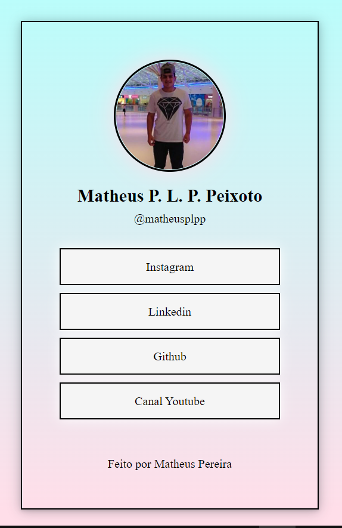
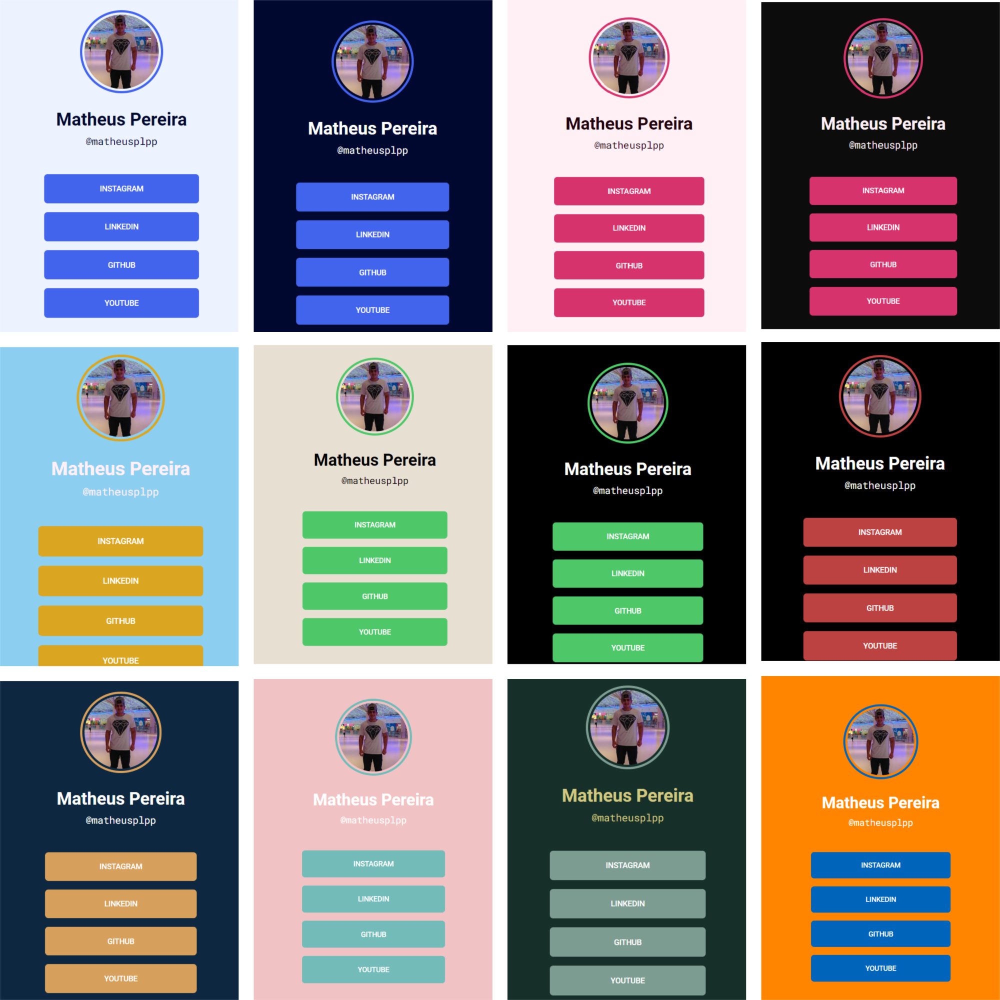

<h1 align="center">

</h1>

<strong>

Projeto feito na Maratona Explorer, evento criado pela Rocketseat

</strong>
 

<h2 align="center">Projeto: Meus links</h2>
 
<h3 align="center">  </h3>

O projeto é um site onde você consegue colocar diversos links em um único link, facilitando demais para compartilhar suas redes sociais e também para colocar por exemplo na bio do instagram que só permite colocar um link.
 
 
<h2>🛠 Tecnologias utilizadas: </h2>
<ul>
    <li>HTML</li>
    <li>CSS</li>
</ul>

<h3 align="center">Outros layouts</h3>
 
 

